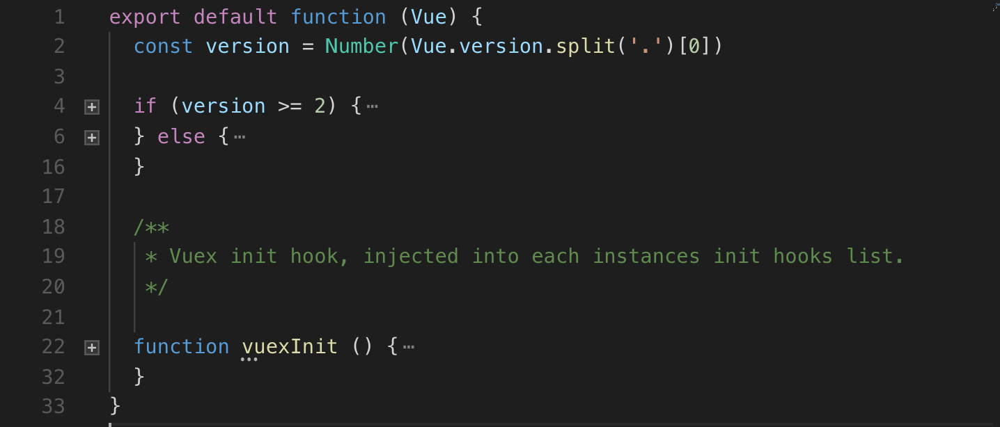

## vuex 基本使用

我们在使用 vuex 的时候，一般如下操作：

```js
// 假设使用了构建工具来开发我们的项目，所以会在一开始使用 import 语句来引入相关的依赖。注意，不要忘记 Vue.use(Vuex)
import Vue from 'vue'
import Vuex from 'vuex'

Vue.use(Vuex)

const store = new Vuex.Store({
  state: {
    count: 0
  },
  mutations: {
    increment (state) {
      state.count++
    }
  }
})

console.log(store.state.count) // -> 0
store.commit('increment')
console.log(store.state.count) // -> 1
```

从这个最基础的使用方法中我们能大概的一窥究竟：我们引入的 Vuex 在后面用 new 来调用了它身上的 Store，所以 Vuex.Store 一定是一个类（也可能是通过 Function 来模拟的，不过具体细节不重要，我们首先有一个大概的轮廓就行），Vuex 本身可能是一个 Object。

然后，new 出来的这个实例是真正要关心的，通过 state 来获取整个 store 的状态，通过显示提交 mutation 来更改 state。

## vuex 的目录结构

整个的目录结构如下，这里并没有截全。我们只需要简单粗暴的聚焦 src 目录就行，其他的暂时先不用管


## index.js 文件

这是 vuex 的出口文件，我们在上面 `import Vuex from 'vuex` 其实就是导入的这里面的东西。整个文件的内容很简单，我就直接贴上来了，然后逐一做下说明

```js
import { Store, install } from './store'
import { mapState, mapMutations, mapGetters, mapActions, createNamespacedHelpers } from './helpers'

export default {
  Store,
  install,
  version: '__VERSION__',
  mapState,
  mapMutations,
  mapGetters,
  mapActions,
  createNamespacedHelpers
}
```

先是引入了一堆乱七八糟的东西，然后把它们放到一个字面量的 object 中，最后用 export default 语法直接导出。所以这里的整个思路和一开始说的大概相同。

### install 是个什么鬼

从 store 文件中结构出来了 Store 和 install 两个东西，Store 就是在最上面通过 new 操作符调用的类，后面我们会着重介绍。 但是 install 是个什么鬼？大部分用过 vuex 的同学可能对 `mapState、mapMutations、mapGetters、mapActions`比较熟悉，然而这个 `install` 究竟是个什么鬼，我们在平常开发中好像从来没有察觉过他的存在。

这就要牵扯出来 vue 的插件机制了，[点击这里查看 vue 插件 ](https://cn.vuejs.org/v2/guide/plugins.html)

通过文档大概能总结出以下几点：

1. 开发的插件应该通过全局方法 `Vue.use()` 使用。它需要在你调用 `new Vue()` 启动应用之前完成

   ```js
   // 调用 `MyPlugin.install(Vue)`
   Vue.use(MyPlugin)
   
   new Vue({
     //... options
   })
   ```

   这就解释了为什么一开始要使用 Vue.use 方法

2. Vue.js 的插件应该有一个公开方法 `install`。这个方法的第一个参数是 `Vue` 构造器，第二个参数是一个可选的选项对象

   ```js
   MyPlugin.install = function (Vue, options) {
     // 1. 添加全局方法或属性
     Vue.myGlobalMethod = function () {
       // 逻辑...
     }
   
     // 2. 添加全局资源
     Vue.directive('my-directive', {
       bind (el, binding, vnode, oldVnode) {
         // 逻辑...
       }
       ...
     })
   
     // 3. 注入组件
     Vue.mixin({
       created: function () {
         // 逻辑...
       }
       ...
     })
   
     // 4. 添加实例方法
     Vue.prototype.$myMethod = function (methodOptions) {
       // 逻辑...
     }
   }
   ```

   install 方法会接受 vue 作为作为参数，所以我们能在这个函数里做很多事情，比如直接在 vue 实例上添加方法、通过 mixin 注入一些东西

## store.js 文件


这个文件是整个 vuex 的核心，代码比较多，我们还是先大概预览下整个文件，明白导入导出什么，然后在一层层的细致的去深入到具体实现

### 再探 install

store 文件其实就导出了两个东西，就是上面提到的 Store 类和 install 函数，下面我们就来看看 `install` 到底是怎么工作的

```js
let Vue // bind on install
export function install (_Vue) {
  if (Vue && _Vue === Vue) {
    if (process.env.NODE_ENV !== 'production') {
      console.error(
        '[vuex] already installed. Vue.use(Vuex) should be called only once.'
      )
    }
    return
  }
  Vue = _Vue
  applyMixin(Vue)
}
```

通过插件机制知道这个方法最后其实是这样执行的：

```js
Vuex.install(Vue) // Vue 是构造函数
```

一开始在文件的上面就定义了一个变量 Vue，如果 install 函数第一次执行，那么就会把传入的 _Vue(Vue构造函数)进行缓存。如果 install 被多次调用，就会走上面的判断，给出 error 告诉开发者 vuex 已经注册了，没必要重复注册。整个流程还是比较简单的，接下来就到了 applyMixin 里面

### mixin.js 文件



整个文件只有 30 来行，我们先看上面部分

```js
export default function (Vue) {
  // vue 已经有好几个版本了，在2这个大版本中有很大的改动。所以为了兼容不同版本，具体注册的代码有些不同
  // vue 版本的格式是 vXX.XX.XX,用 . 来进行分割，最新的 release 版本是 v2.5.17
  // 所以在这里通过 '.' 来进行分割，拿到大版本号
  const version = Number(Vue.version.split('.')[0])

  // 如果是 >=2 版本，通过 mixin hook 注入
  if (version >= 2) {
    Vue.mixin({ beforeCreate: vuexInit })
  } else {
    // override init and inject vuex init procedure
    // for 1.x backwards compatibility.
    // 1.x 以及之前的版本则需要重写并替换 Vue 原型的 _init 函数
    const _init = Vue.prototype._init
    Vue.prototype._init = function (options = {}) {
      options.init = options.init
        ? [vuexInit].concat(options.init)
        : vuexInit
      _init.call(this, options)
    }
  }
    
  function vuexInit (){}
}
```

```js
  /**
   * Vuex init hook, injected into each instances init hooks list.
   */

  function vuexInit () {
    // $options 就是 new Vue 时传进去的 参数
    const options = this.$options
    // store injection
    // 如果有 store，直接挂在到 Vue 实例的 $store 上
    // 这样根组件就能通过 this.$store 来访问
    if (options.store) {
      this.$store = typeof options.store === 'function'
        ? options.store()
        : options.store
    } else if (options.parent && options.parent.$store) {
      // 进来这个流程说明是子组件
      // 子组件是没有 store 的，那从哪里来呢？
      // 直接指向父组件的 $store ，层层嵌套进行设置
      // 这样每个组件就都能通过 this.$store 来访问 store 对象了
      this.$store = options.parent.$store
    }
  }
```


### store对象构造


通过 new 操作符构建出来的 store 实例拥有一些方法，比如 `store.commit、store.dispatch`等，而且内部还把 state 包装成了 getter 和 setter。

我们首先来看这个 getter 和 setter

```js
// util.js
function assert (condition, msg) {
  if (!condition) throw new Error(`[vuex] ${msg}`)
} 

get state () {
  return this._vm._data.$$state
}

set state (v) {
  if (process.env.NODE_ENV !== 'production') {
    // assert 是一个断言，顾明思议就是用来根据环境来判断一些东西的函数
    assert(false, `Use store.replaceState() to explicit replace store state.`)
  }
}
```

为什么要把 store.state 包装一下呢？如果是一个 object 或者简单类型不是更方便吗？

vuex 文档中有相关描述：

```
再次强调，我们通过提交 mutation 的方式，而非直接改变 store.state.count，是因为我们想要更明确地追踪到状态的变化。这个简单的约定能够让你的意图更加明显，这样你在阅读代码的时候能更容易地解读应用内部的状态改变。此外，这样也让我们有机会去实现一些能记录每次状态改变，保存状态快照的调试工具。有了它，我们甚至可以实现如时间穿梭般的调试体验。
```

所以，当你直接用 `store.state = xxx ` 这种方式来直接修改 state 时，生产环境vue 通过断言会直接给你报错，非生产环境就静默失败了

```js
  constructor (options = {}) {
    // Auto install if it is not done yet and `window` has `Vue`.
    // To allow users to avoid auto-installation in some cases,
    // this code should be placed here. See #731
    // 如果 window.Vue 存在，自动安装
    if (!Vue && typeof window !== 'undefined' && window.Vue) {
      install(window.Vue)
    }

    if (process.env.NODE_ENV !== 'production') {
      // 根据变量 Vue 的值判断是否已经安装过 vuex
      assert(Vue, `must call Vue.use(Vuex) before creating a store instance.`)
      // 当前环境是否支持 Promise
      assert(typeof Promise !== 'undefined', `vuex requires a Promise polyfill in this browser.`)
      // 是否是通过 new 操作符来创建 store 对象的
      assert(this instanceof Store, `Store must be called with the new operator.`)
    }

    // 在环境变量判断之后, 在构造函数中会定义一些变量, 这些变量一部分来自 options, 一部分是内部定义
    const {
      plugins = [],
      // 是否开启严格模式
      // 在严格模式下，无论何时发生了状态变更且不是由 mutation 函数引起的，将会抛出错误
      strict = false 
    } = options

    let {
      // 获取初始的 state
      state = {}
    } = options
    if (typeof state === 'function') {
      // 如果 state 是个函数，则调用
      state = state() || {}
    }

    // store internal state
    // 在 Store 的实例上挂载一些内部属性

    // 是否在进行 commit 的状态标识
    this._committing = false
    // 用户定义的 actions
    this._actions = Object.create(null)
    // _actions 的订阅发布
    this._actionSubscribers = []
    // 用户定义的 mutations
    this._mutations = Object.create(null)
    // 用户定义的 getters
    this._wrappedGetters = Object.create(null)
    // 收集用户定义的 modules，
    this._modules = new ModuleCollection(options)
    // 模块命名空间map
    this._modulesNamespaceMap = Object.create(null)
    this._subscribers = []
	// 创建一个 Vue 实例, 利用 $watch 监测 store 数据的变化
    this._watcherVM = new Vue()

    // bind commit and dispatch to self
    // 下面几行代码主要是绑定 context 
    // 防止结构使用情况下 this 丢失的问题
    const store = this
    
    const { dispatch, commit } = this
    this.dispatch = function boundDispatch (type, payload) {
      // 没有通过 bind , 创建了一个包裹函数，内部通过 call 调用
      return dispatch.call(store, type, payload)
    }
    this.commit = function boundCommit (type, payload, options) {
      // 没有通过 bind , 创建了一个包裹函数，内部通过 call 调用
      return commit.call(store, type, payload, options)
    }

    // strict mode
    // 在 store 实例上挂载是否是严格模式
    this.strict = strict

    // init root module.
    // this also recursively registers all sub-modules
    // and collects all module getters inside this._wrappedGetters
    installModule(this, state, [], this._modules.root)

    // initialize the store vm, which is responsible for the reactivity
    // (also registers _wrappedGetters as computed properties)
    resetStoreVM(this, state)

    // apply plugins
    // 安装插件
    plugins.forEach(plugin => plugin(this))
	
    // 是否启用 devtoolPlugin 插件
    if (Vue.config.devtools) {
      devtoolPlugin(this)
    }
  }
```

